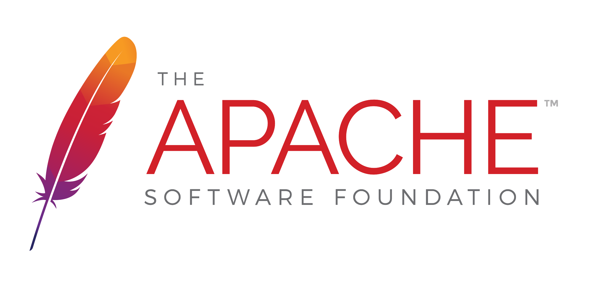

<link rel="stylesheet" href="./styles.css">

<h1 align="center">
    <a>
        Welcome to MeyDey's GitHub page!
    </a>
</h1>

    

### I am a young developer trying to make his way through the code galaxy.

 

<body>

### Here are the languages that i learned and used so far:

<code></code>
<code></code>
<code></code>
<code></code>
<code></code>
<code></code>
<code></code>

 

### I also learned and used :

    
    

 

    
    

 

    
    

 

 

    <code></code>
    <code></code>
    <code></code>
    <code></code>

 

#### My most used languages :

### I am currently learning

</body>

## Contact me :

    
    <a href="https://www.linkedin.com/in/mederic-marquie/">
        <code></code>
    </a>

### Thank you for visiting my GitHub page !

    

